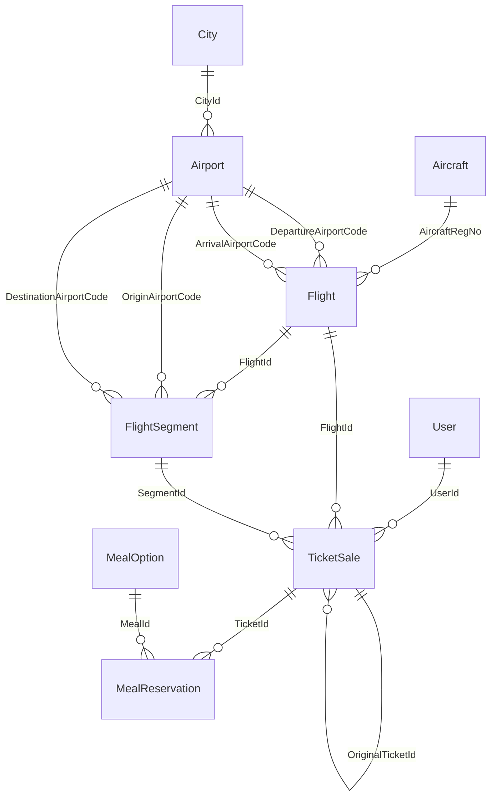
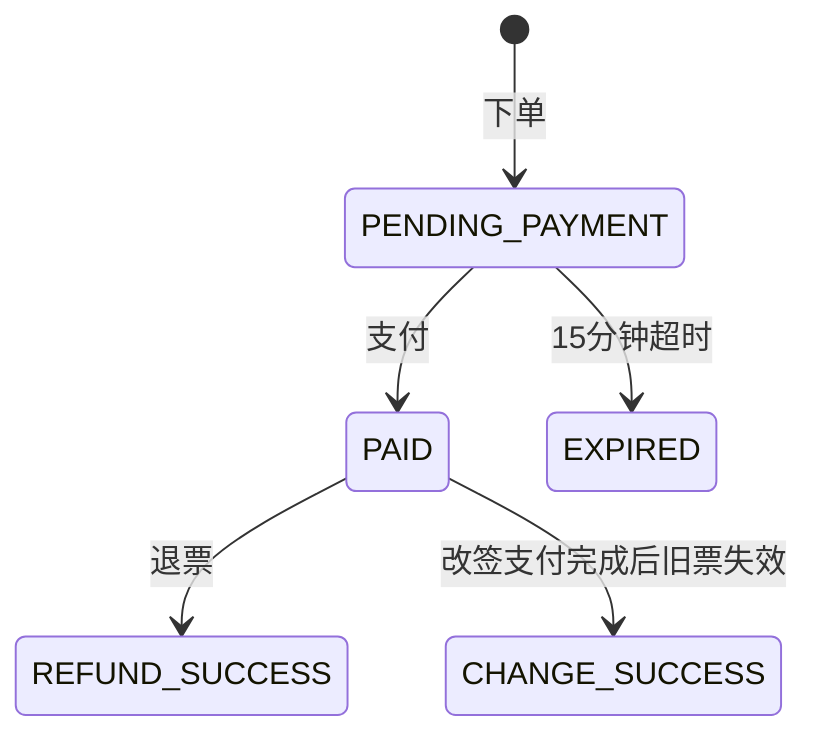

# 航空票务系统数据库对接文档

本文档给数据库同学使用，内容严格基于当前项目后端实际代码和 `database/schema.sql` 生成。

后端代码基准：

- 数据库配置：`backend/src/main/resources/application.properties`
- 实体映射：`backend/src/main/java/com/example/airticket/entity`
- Repository：`backend/src/main/java/com/example/airticket/repository`
- 业务事务：`backend/src/main/java/com/example/airticket/service`
- 建表脚本：`database/schema.sql`
- 种子数据：`database/seed_data.sql`

重要原则：

- 数据库必须严格遵守 ER 图。
- 当前项目只允许 9 张核心业务表：`City`、`Airport`、`Aircraft`、`User`、`MealOption`、`Flight`、`FlightSegment`、`TicketSale`、`MealReservation`。
- 不要新增核心业务表。
- 不要删除 ER 图字段。
- 不要修改主键、外键关系。
- 后端使用 Spring Data JPA，`ddl-auto=none`，也就是说后端不会自动建表，必须先由数据库脚本创建表。
- 正常业务不使用物理删除。所谓“删除/停用/注销”基本通过现有字段改状态或匿名化完成。

---

## 1. 后端与 MySQL 9.6 对接方式

### 1.1 技术链路

```text
Spring Boot Controller
  ↓
Service 事务层
  ↓
Repository / Spring Data JPA
  ↓
MySQL Connector/J
  ↓
MySQL 9.6 数据库 airticket
```

数据库同学只需要保证：

1. 本地 MySQL 正常启动。
2. 存在数据库 `airticket`。
3. 9 张表结构和 `database/schema.sql` 完全一致。
4. 初始数据可导入 `database/seed_data.sql`。
5. 后端配置的账号密码可以连接数据库。

---

### 1.2 数据库连接配置

当前后端配置文件为：

```properties
server.port=8080

spring.datasource.url=jdbc:mysql://localhost:3306/airticket?useSSL=false&allowPublicKeyRetrieval=true&serverTimezone=Asia/Shanghai&characterEncoding=utf8
spring.datasource.username=root
spring.datasource.password=051130
spring.datasource.driver-class-name=com.mysql.cj.jdbc.Driver

spring.jpa.hibernate.ddl-auto=none
spring.jpa.open-in-view=false
spring.jpa.properties.hibernate.dialect=org.hibernate.dialect.MySQL8Dialect
spring.jpa.properties.hibernate.format_sql=true

spring.jackson.time-zone=Asia/Shanghai
spring.jackson.date-format=yyyy-MM-dd'T'HH:mm:ss
spring.jpa.hibernate.naming.physical-strategy=org.hibernate.boot.model.naming.PhysicalNamingStrategyStandardImpl
```

配置含义：

| 配置项 | 当前值 | 说明 |
|---|---|---|
| `server.port` | `8080` | 后端服务端口 |
| `spring.datasource.url` | `jdbc:mysql://localhost:3306/airticket...` | 连接本机 MySQL 的 `airticket` 数据库 |
| `spring.datasource.username` | `root` | MySQL 用户名 |
| `spring.datasource.password` | `051130` | MySQL 密码 |
| `driver-class-name` | `com.mysql.cj.jdbc.Driver` | MySQL JDBC 驱动 |
| `ddl-auto` | `none` | 后端不自动创建、修改、删除表 |
| `open-in-view` | `false` | Controller 返回前必须在 Service/Repository 里取到需要的数据 |
| `hibernate.dialect` | `MySQL8Dialect` | Hibernate 使用 MySQL 方言 |
| `PhysicalNamingStrategyStandardImpl` | 标准命名 | Java 字段不会自动转下划线，必须显式映射到 ER 字段名 |

---

### 1.3 初始化数据库命令

在项目根目录打开 PowerShell，执行：

```powershell
mysql -u root -p051130 < database\schema.sql
mysql -u root -p051130 airticket < database\seed_data.sql
```

如果想清空后重新初始化：

```powershell
mysql -u root -p051130 -e "DROP DATABASE IF EXISTS airticket;"
mysql -u root -p051130 < database\schema.sql
mysql -u root -p051130 airticket < database\seed_data.sql
```

注意：

- `-p051130` 中间不要加空格。
- 本项目不需要图形化工具，命令行即可。
- `schema.sql` 会创建数据库和 9 张表。
- `seed_data.sql` 会导入演示数据。

---

## 2. 数据库表总览

9 张表及作用：

| 表名 | 作用 | 主键 |
|---|---|---|
| `City` | 城市信息 | `CityId` |
| `Airport` | 机场信息 | `AirportCode` |
| `Aircraft` | 飞机信息 | `AircraftRegNo` |
| `User` | 用户信息，包括乘客和管理员 | `UserId` |
| `MealOption` | 餐食选项 | `MealId` |
| `Flight` | 航班主信息 | `FlightId` |
| `FlightSegment` | 可售航段，是最小售票单位 | `SegmentId` |
| `TicketSale` | 订单/机票销售记录 | `TicketId` |
| `MealReservation` | 订单选择的餐食 | `MealReservationId` |

表关系：



---

## 3. 详细表结构

以下字段、类型、约束均来自 `database/schema.sql`。

---

### 3.1 City 城市表

建表作用：保存城市基础信息。

| 字段名 | 类型 | 可空 | 键/约束 | 说明 |
|---|---|---|---|---|
| `CityId` | `INT` | 否 | 主键，自增 | 城市 ID |
| `CityName` | `VARCHAR(50)` | 否 | 唯一 | 城市名，例如 `北京` |
| `CityCode` | `VARCHAR(20)` | 否 | 无 | 城市代码，例如 `BJS` |
| `Country` | `VARCHAR(50)` | 否 | 无 | 国家，例如 `中国` |

索引和约束：

| 名称 | 类型 | 字段 | 说明 |
|---|---|---|---|
| 主键 | Primary Key | `CityId` | 城市唯一标识 |
| 唯一约束 | Unique | `CityName` | 城市名不能重复 |

Java 实体映射：

| Java 字段 | 数据库列 |
|---|---|
| `cityId` | `CityId` |
| `cityName` | `CityName` |
| `cityCode` | `CityCode` |
| `country` | `Country` |

常用 SQL：

```sql
-- 查询全部城市
SELECT CityId, CityName, CityCode, Country
FROM City;

-- 查询单个城市
SELECT CityId, CityName, CityCode, Country
FROM City
WHERE CityId = ?;

-- 新增城市
INSERT INTO City (CityName, CityCode, Country)
VALUES (?, ?, ?);

-- 修改城市
UPDATE City
SET CityName = ?, CityCode = ?, Country = ?
WHERE CityId = ?;
```

删除规则：

- 正常业务不删除城市。
- `City` 表没有停用字段。
- 后端 `/api/admin/city/disable` 会直接返回业务错误。

---

### 3.2 Airport 机场表

建表作用：保存机场基础信息，机场属于城市。

| 字段名 | 类型 | 可空 | 键/约束 | 说明 |
|---|---|---|---|---|
| `AirportCode` | `VARCHAR(20)` | 否 | 主键 | 机场代码，例如 `PEK` |
| `AirportName` | `VARCHAR(100)` | 否 | 无 | 机场名称 |
| `CityId` | `INT` | 否 | 外键 | 所属城市 |
| `IsInternational` | `BOOLEAN` | 否 | 默认 `FALSE` | 是否国际机场 |

索引和约束：

| 名称 | 类型 | 字段 | 引用 |
|---|---|---|---|
| 主键 | Primary Key | `AirportCode` | 无 |
| `fk_airport_city` | Foreign Key | `CityId` | `City(CityId)` |

Java 实体映射：

| Java 字段 | 数据库列 | 说明 |
|---|---|---|
| `airportCode` | `AirportCode` | 主键 |
| `airportName` | `AirportName` | 机场名 |
| `city` | `CityId` | `ManyToOne`，后端返回机场时会带城市对象 |
| `isInternational` | `IsInternational` | 是否国际 |

常用 SQL：

```sql
-- 查询全部机场
SELECT AirportCode, AirportName, CityId, IsInternational
FROM Airport;

-- 按城市查询机场
SELECT AirportCode, AirportName, CityId, IsInternational
FROM Airport
WHERE CityId = ?;

-- 查询单个机场
SELECT AirportCode, AirportName, CityId, IsInternational
FROM Airport
WHERE AirportCode = ?;

-- 新增机场
INSERT INTO Airport (AirportCode, AirportName, CityId, IsInternational)
VALUES (?, ?, ?, ?);

-- 修改机场
UPDATE Airport
SET AirportName = ?, CityId = ?, IsInternational = ?
WHERE AirportCode = ?;
```

删除规则：

- 正常业务不删除机场。
- `Airport` 表没有停用字段。
- 后端 `/api/admin/airport/disable` 会直接返回业务错误。

---

### 3.3 Aircraft 飞机表

建表作用：保存飞机注册号、机型、座位数和状态。

| 字段名 | 类型 | 可空 | 键/约束 | 说明 |
|---|---|---|---|---|
| `AircraftRegNo` | `VARCHAR(20)` | 否 | 主键 | 飞机注册号，例如 `B-1001` |
| `AircraftType` | `VARCHAR(50)` | 否 | 无 | 机型，例如 `A320` |
| `Manufacturer` | `VARCHAR(50)` | 否 | 无 | 制造商 |
| `TotalFirstClassSeats` | `INT` | 否 | `>= 0` | 头等舱总座位 |
| `TotalEconomySeats` | `INT` | 否 | `>= 0` | 经济舱总座位 |
| `Status` | `VARCHAR(20)` | 否 | 无 | 状态，当前代码常用 `NORMAL`、`DISABLED` |
| `Remark` | `VARCHAR(255)` | 是 | 无 | 备注 |

索引和约束：

| 名称 | 类型 | 字段 | 说明 |
|---|---|---|---|
| 主键 | Primary Key | `AircraftRegNo` | 飞机唯一标识 |
| `ck_aircraft_first_seats` | Check | `TotalFirstClassSeats >= 0` | 座位数不能负数 |
| `ck_aircraft_economy_seats` | Check | `TotalEconomySeats >= 0` | 座位数不能负数 |

常用 SQL：

```sql
-- 查询全部飞机
SELECT AircraftRegNo, AircraftType, Manufacturer,
       TotalFirstClassSeats, TotalEconomySeats, Status, Remark
FROM Aircraft;

-- 查询单个飞机
SELECT *
FROM Aircraft
WHERE AircraftRegNo = ?;

-- 新增飞机
INSERT INTO Aircraft (
  AircraftRegNo, AircraftType, Manufacturer,
  TotalFirstClassSeats, TotalEconomySeats, Status, Remark
) VALUES (?, ?, ?, ?, ?, ?, ?);

-- 修改飞机
UPDATE Aircraft
SET AircraftType = ?,
    Manufacturer = ?,
    TotalFirstClassSeats = ?,
    TotalEconomySeats = ?,
    Status = ?,
    Remark = ?
WHERE AircraftRegNo = ?;

-- 停用飞机，不物理删除
UPDATE Aircraft
SET Status = 'DISABLED'
WHERE AircraftRegNo = ?;
```

删除规则：

- 不物理删除。
- 管理员停用飞机时，后端会把 `Status` 更新为 `DISABLED`。

---

### 3.4 User 用户表

建表作用：保存乘客和管理员账号。

注意：表名是 MySQL 关键字，所以 SQL 中建议写成反引号形式：`` `User` ``。

| 字段名 | 类型 | 可空 | 键/约束 | 说明 |
|---|---|---|---|---|
| `UserId` | `INT` | 否 | 主键，自增 | 用户 ID |
| `LoginAccount` | `VARCHAR(50)` | 否 | 唯一 | 登录账号 |
| `UserName` | `VARCHAR(50)` | 否 | 无 | 用户姓名 |
| `IdNumberDigest` | `VARCHAR(64)` | 否 | 唯一 | 身份证摘要，不存明文 |
| `PasswordHash` | `VARCHAR(100)` | 否 | 无 | BCrypt 密码哈希 |
| `UserType` | `VARCHAR(20)` | 否 | Check | `PASSENGER` 或 `ADMIN` |
| `PhoneNumber` | `VARCHAR(20)` | 是 | 无 | 手机号 |
| `Email` | `VARCHAR(100)` | 是 | 无 | 邮箱 |
| `Points` | `INT` | 否 | 默认 `0`，`>=0` | 积分 |
| `MemberLevel` | `VARCHAR(20)` | 否 | 默认 `NORMAL`，Check | `NORMAL` 或 `VIP` |
| `CreatedAt` | `DATETIME` | 否 | 默认当前时间 | 创建时间 |
| `UpdatedAt` | `DATETIME` | 否 | 默认当前时间，更新时自动更新 | 更新时间 |

索引和约束：

| 名称 | 类型 | 字段 | 说明 |
|---|---|---|---|
| 主键 | Primary Key | `UserId` | 用户唯一标识 |
| 唯一约束 | Unique | `LoginAccount` | 登录账号不能重复 |
| 唯一约束 | Unique | `IdNumberDigest` | 同一身份证不能重复注册 |
| `ck_user_type` | Check | `UserType` | 只能是 `PASSENGER`、`ADMIN` |
| `ck_member_level` | Check | `MemberLevel` | 只能是 `NORMAL`、`VIP` |
| `ck_points` | Check | `Points >= 0` | 积分不能负数 |

安全规则：

- 密码用 BCrypt，不允许存明文。
- 身份证号用 SHA-256 摘要，不允许存明文。
- 后端摘要函数有固定盐：`DatabasePJ-AirTicket`。

常用 SQL：

```sql
-- 查询全部用户
SELECT UserId, LoginAccount, UserName, IdNumberDigest, PasswordHash,
       UserType, PhoneNumber, Email, Points, MemberLevel, CreatedAt, UpdatedAt
FROM `User`;

-- 按登录账号查询用户，登录时使用
SELECT *
FROM `User`
WHERE LoginAccount = ?;

-- 按身份证摘要查询，注册去重时使用
SELECT *
FROM `User`
WHERE IdNumberDigest = ?;

-- 注册乘客
INSERT INTO `User` (
  LoginAccount, UserName, IdNumberDigest, PasswordHash,
  UserType, PhoneNumber, Email, Points, MemberLevel
) VALUES (?, ?, ?, ?, 'PASSENGER', ?, ?, 0, 'NORMAL');

-- 支付后加积分
UPDATE `User`
SET Points = Points + 100
WHERE UserId = ?;

UPDATE `User`
SET MemberLevel = CASE WHEN Points >= 1000 THEN 'VIP' ELSE 'NORMAL' END
WHERE UserId = ?;

-- 退票后扣积分，最低为 0
UPDATE `User`
SET Points = GREATEST(0, Points - 100)
WHERE UserId = ?;

UPDATE `User`
SET MemberLevel = CASE WHEN Points >= 1000 THEN 'VIP' ELSE 'NORMAL' END
WHERE UserId = ?;
```

注销账号 SQL 逻辑：

```sql
-- 后端实际是把账号匿名化失效，不物理删除
UPDATE `User`
SET LoginAccount = ?,
    UserName = ?,
    PhoneNumber = NULL,
    Email = NULL,
    Points = 0,
    MemberLevel = 'NORMAL',
    IdNumberDigest = ?,
    PasswordHash = ?
WHERE UserId = ?
  AND UserType = 'PASSENGER';
```

删除规则：

- 不允许物理删除用户。
- 因为 `TicketSale.UserId` 外键引用用户，删除会破坏历史订单。
- 管理员账号不允许注销。

---

### 3.5 MealOption 餐食选项表

建表作用：保存可选餐食。

| 字段名 | 类型 | 可空 | 键/约束 | 说明 |
|---|---|---|---|---|
| `MealId` | `INT` | 否 | 主键，自增 | 餐食 ID |
| `MealName` | `VARCHAR(50)` | 否 | 唯一 | 餐食名 |
| `MealType` | `VARCHAR(50)` | 否 | 无 | 餐食类型 |
| `IsAvailable` | `BOOLEAN` | 否 | 默认 `TRUE` | 是否可用 |
| `Description` | `VARCHAR(255)` | 是 | 无 | 描述 |

常用 SQL：

```sql
-- 查询全部餐食
SELECT MealId, MealName, MealType, IsAvailable, Description
FROM MealOption;

-- 查询可用餐食
SELECT MealId, MealName, MealType, IsAvailable, Description
FROM MealOption
WHERE IsAvailable = TRUE;

-- 新增餐食
INSERT INTO MealOption (MealName, MealType, IsAvailable, Description)
VALUES (?, ?, ?, ?);

-- 修改餐食
UPDATE MealOption
SET MealName = ?, MealType = ?, IsAvailable = ?, Description = ?
WHERE MealId = ?;

-- 停用餐食，不物理删除
UPDATE MealOption
SET IsAvailable = FALSE
WHERE MealId = ?;
```

删除规则：

- 不物理删除。
- 停用餐食通过 `IsAvailable=false`。

---

### 3.6 Flight 航班表

建表作用：保存航班主信息。一个航班可以有多个可售航段。

| 字段名 | 类型 | 可空 | 键/约束 | 说明 |
|---|---|---|---|---|
| `FlightId` | `INT` | 否 | 主键，自增 | 航班 ID |
| `FlightNumber` | `VARCHAR(20)` | 否 | 联合唯一 | 航班号 |
| `FlightDate` | `DATE` | 否 | 联合唯一、普通索引 | 航班日期 |
| `AircraftRegNo` | `VARCHAR(20)` | 否 | 外键 | 飞机注册号 |
| `FlightStatus` | `VARCHAR(20)` | 否 | Check、普通索引 | 航班状态 |
| `DepartureAirportCode` | `VARCHAR(20)` | 否 | 外键 | 整个航班出发机场 |
| `ArrivalAirportCode` | `VARCHAR(20)` | 否 | 外键 | 整个航班到达机场 |
| `Remark` | `VARCHAR(255)` | 是 | 无 | 备注 |

允许的 `FlightStatus`：

| 值 | 含义 |
|---|---|
| `NORMAL` | 正常，可售 |
| `DELAYED` | 延误，可售 |
| `CANCELLED` | 取消，不可售 |
| `COMPLETED` | 已完成，不可售 |
| `DISABLED` | 管理员停用，不可售 |

索引和约束：

| 名称 | 类型 | 字段 | 说明 |
|---|---|---|---|
| 主键 | Primary Key | `FlightId` | 航班唯一标识 |
| `fk_flight_aircraft` | Foreign Key | `AircraftRegNo` | 引用 `Aircraft(AircraftRegNo)` |
| `fk_flight_departure_airport` | Foreign Key | `DepartureAirportCode` | 引用 `Airport(AirportCode)` |
| `fk_flight_arrival_airport` | Foreign Key | `ArrivalAirportCode` | 引用 `Airport(AirportCode)` |
| `ck_flight_status` | Check | `FlightStatus` | 只能取 5 个固定状态 |
| `uk_flight_number_date` | Unique | `FlightNumber, FlightDate` | 同一天同航班号不能重复 |
| `idx_flight_date` | Index | `FlightDate` | 按日期查询 |
| `idx_flight_status` | Index | `FlightStatus` | 按状态查询 |

常用 SQL：

```sql
-- 查询全部航班
SELECT FlightId, FlightNumber, FlightDate, AircraftRegNo, FlightStatus,
       DepartureAirportCode, ArrivalAirportCode, Remark
FROM Flight;

-- 查询单个航班
SELECT *
FROM Flight
WHERE FlightId = ?;

-- 新增航班
INSERT INTO Flight (
  FlightNumber, FlightDate, AircraftRegNo, FlightStatus,
  DepartureAirportCode, ArrivalAirportCode, Remark
) VALUES (?, ?, ?, ?, ?, ?, ?);

-- 修改未产生订单的航班
UPDATE Flight
SET FlightNumber = ?,
    FlightDate = ?,
    AircraftRegNo = ?,
    FlightStatus = ?,
    DepartureAirportCode = ?,
    ArrivalAirportCode = ?,
    Remark = ?
WHERE FlightId = ?;

-- 修改已产生订单的航班，后端只允许改状态和备注
UPDATE Flight
SET FlightStatus = ?,
    Remark = ?
WHERE FlightId = ?;

-- 停用航班
UPDATE Flight
SET FlightStatus = 'DISABLED'
WHERE FlightId = ?;

-- 恢复航班
UPDATE Flight
SET FlightStatus = 'NORMAL'
WHERE FlightId = ?;
```

删除规则：

- 不物理删除航班。
- 删除/停用通过 `FlightStatus='DISABLED'`。
- 因为 `TicketSale.FlightId` 引用航班，不能随便删。

---

### 3.7 FlightSegment 航段表

建表作用：保存可售航段。`FlightSegment` 是最小售票单位。

例如一个航班 A → B → C，可以有 3 个可售航段：

- A → B
- B → C
- A → C

订单只能绑定一个 `SegmentId`，不能一次绑定多个航段。

| 字段名 | 类型 | 可空 | 键/约束 | 说明 |
|---|---|---|---|---|
| `SegmentId` | `INT` | 否 | 主键，自增 | 航段 ID |
| `FlightId` | `INT` | 否 | 外键、联合唯一 | 所属航班 |
| `OriginStopNo` | `INT` | 否 | 联合唯一、Check | 起点站序 |
| `DestinationStopNo` | `INT` | 否 | 联合唯一、Check | 终点站序 |
| `OriginAirportCode` | `VARCHAR(20)` | 否 | 外键、普通索引 | 起飞机场 |
| `DestinationAirportCode` | `VARCHAR(20)` | 否 | 外键、普通索引 | 到达机场 |
| `PlannedDepartureTime` | `DATETIME` | 否 | 普通索引 | 计划起飞时间 |
| `PlannedArrivalTime` | `DATETIME` | 否 | 无 | 计划到达时间 |
| `ActualDepartureTime` | `DATETIME` | 是 | 无 | 实际起飞时间 |
| `ActualArrivalTime` | `DATETIME` | 是 | 无 | 实际到达时间 |
| `DelayMinutes` | `INT` | 是 | 默认 `0`，`>=0` | 延误分钟 |
| `DelayReason` | `VARCHAR(255)` | 是 | 无 | 延误原因 |
| `FirstClassRemainingSeats` | `INT` | 否 | `>=0` | 头等舱剩余座位 |
| `EconomyRemainingSeats` | `INT` | 否 | `>=0` | 经济舱剩余座位 |
| `FirstClassPrice` | `DECIMAL(10,2)` | 否 | `>=0` | 头等舱价格 |
| `EconomyPrice` | `DECIMAL(10,2)` | 否 | `>=0` | 经济舱价格 |
| `Remark` | `VARCHAR(255)` | 是 | 无 | 备注 |

索引和约束：

| 名称 | 类型 | 字段 | 说明 |
|---|---|---|---|
| 主键 | Primary Key | `SegmentId` | 航段唯一标识 |
| `fk_segment_flight` | Foreign Key | `FlightId` | 引用 `Flight(FlightId)` |
| `fk_segment_origin_airport` | Foreign Key | `OriginAirportCode` | 引用 `Airport(AirportCode)` |
| `fk_segment_destination_airport` | Foreign Key | `DestinationAirportCode` | 引用 `Airport(AirportCode)` |
| `ck_segment_stop_order` | Check | `OriginStopNo < DestinationStopNo` | 起点站序必须小于终点站序 |
| `ck_segment_delay` | Check | `DelayMinutes >= 0` | 延误不能负数 |
| `ck_segment_first_inventory` | Check | `FirstClassRemainingSeats >= 0` | 库存不能负数 |
| `ck_segment_economy_inventory` | Check | `EconomyRemainingSeats >= 0` | 库存不能负数 |
| `ck_segment_first_price` | Check | `FirstClassPrice >= 0` | 价格不能负数 |
| `ck_segment_economy_price` | Check | `EconomyPrice >= 0` | 价格不能负数 |
| `uk_segment_route` | Unique | `FlightId, OriginStopNo, DestinationStopNo` | 同一航班同一站序区间不能重复 |
| `idx_segment_origin_destination` | Index | `OriginAirportCode, DestinationAirportCode` | 航班搜索使用 |
| `idx_segment_departure_time` | Index | `PlannedDepartureTime` | 按起飞时间查询 |

常用 SQL：

```sql
-- 查询全部航段
SELECT *
FROM FlightSegment;

-- 查询某航班的全部航段
SELECT *
FROM FlightSegment
WHERE FlightId = ?;

-- 根据起降机场和日期范围搜索航段
SELECT s.*
FROM FlightSegment s
JOIN Flight f ON s.FlightId = f.FlightId
WHERE s.OriginAirportCode IN (?, ?)
  AND s.DestinationAirportCode IN (?, ?)
  AND f.FlightDate BETWEEN ? AND ?;

-- 新增航段
INSERT INTO FlightSegment (
  FlightId, OriginStopNo, DestinationStopNo,
  OriginAirportCode, DestinationAirportCode,
  PlannedDepartureTime, PlannedArrivalTime,
  ActualDepartureTime, ActualArrivalTime,
  DelayMinutes, DelayReason,
  FirstClassRemainingSeats, EconomyRemainingSeats,
  FirstClassPrice, EconomyPrice, Remark
) VALUES (?, ?, ?, ?, ?, ?, ?, ?, ?, ?, ?, ?, ?, ?, ?, ?);

-- 修改航段
UPDATE FlightSegment
SET FlightId = ?,
    OriginStopNo = ?,
    DestinationStopNo = ?,
    OriginAirportCode = ?,
    DestinationAirportCode = ?,
    PlannedDepartureTime = ?,
    PlannedArrivalTime = ?,
    ActualDepartureTime = ?,
    ActualArrivalTime = ?,
    DelayMinutes = ?,
    DelayReason = ?,
    FirstClassRemainingSeats = ?,
    EconomyRemainingSeats = ?,
    FirstClassPrice = ?,
    EconomyPrice = ?,
    Remark = ?
WHERE SegmentId = ?;
```

库存扣减 SQL：

```sql
-- 下单前必须先锁行，防止并发超卖
SELECT *
FROM FlightSegment
WHERE SegmentId = ?
FOR UPDATE;

-- 经济舱扣库存
UPDATE FlightSegment
SET EconomyRemainingSeats = EconomyRemainingSeats - 1
WHERE SegmentId = ?
  AND EconomyRemainingSeats > 0;

-- 头等舱扣库存
UPDATE FlightSegment
SET FirstClassRemainingSeats = FirstClassRemainingSeats - 1
WHERE SegmentId = ?
  AND FirstClassRemainingSeats > 0;
```

库存恢复 SQL：

```sql
-- 经济舱恢复库存
UPDATE FlightSegment
SET EconomyRemainingSeats = EconomyRemainingSeats + 1
WHERE SegmentId = ?;

-- 头等舱恢复库存
UPDATE FlightSegment
SET FirstClassRemainingSeats = FirstClassRemainingSeats + 1
WHERE SegmentId = ?;
```

删除规则：

- 不物理删除航段。
- `FlightSegment` 表没有停用字段。
- 后端 `/api/admin/segment/disable` 会直接返回业务错误。

---

### 3.8 TicketSale 订单/机票表

建表作用：保存订单、支付、退票、改签记录。

| 字段名 | 类型 | 可空 | 键/约束 | 说明 |
|---|---|---|---|---|
| `TicketId` | `INT` | 否 | 主键，自增 | 订单 ID |
| `OrderNo` | `VARCHAR(32)` | 否 | 唯一 | 订单号 |
| `UserId` | `INT` | 否 | 外键、普通索引 | 用户 ID |
| `FlightId` | `INT` | 否 | 外键、普通索引 | 航班 ID |
| `SegmentId` | `INT` | 否 | 外键、普通索引 | 航段 ID |
| `CabinClass` | `VARCHAR(20)` | 否 | Check | `ECONOMY` 或 `FIRST_CLASS` |
| `TicketStatus` | `VARCHAR(20)` | 否 | Check、复合索引 | 订单状态 |
| `PassengerName` | `VARCHAR(50)` | 否 | 无 | 乘机人姓名 |
| `PassengerIdNumberDigest` | `VARCHAR(64)` | 否 | 无 | 乘机人身份证摘要 |
| `PriceAmount` | `DECIMAL(10,2)` | 否 | `>=0` | 原价 |
| `PaymentAmount` | `DECIMAL(10,2)` | 否 | `>=0` | 实付金额 |
| `OriginalTicketId` | `INT` | 是 | 自关联外键、普通索引 | 改签新票指向旧票 |
| `ChangeReason` | `VARCHAR(255)` | 是 | 无 | 改签原因 |
| `BookedAt` | `DATETIME` | 否 | 无 | 下单时间 |
| `PaidAt` | `DATETIME` | 是 | 无 | 支付时间 |
| `IssuedAt` | `DATETIME` | 是 | 无 | 出票时间 |
| `ChangedAt` | `DATETIME` | 是 | 无 | 改签完成时间 |
| `RefundedAt` | `DATETIME` | 是 | 无 | 退票时间 |
| `ExpiredAt` | `DATETIME` | 是 | 复合索引 | 支付截止时间 |
| `Remark` | `VARCHAR(255)` | 是 | 无 | 备注 |

允许的 `TicketStatus`：

| 值 | 含义 |
|---|---|
| `PENDING_PAYMENT` | 待支付 |
| `PAID` | 已支付 |
| `EXPIRED` | 支付超时 |
| `REFUND_SUCCESS` | 已退票 |
| `CHANGE_SUCCESS` | 已改签，旧票失效 |

索引和约束：

| 名称 | 类型 | 字段 | 说明 |
|---|---|---|---|
| 主键 | Primary Key | `TicketId` | 订单唯一标识 |
| 唯一约束 | Unique | `OrderNo` | 订单号不能重复 |
| `fk_ticket_user` | Foreign Key | `UserId` | 引用 `User(UserId)` |
| `fk_ticket_flight` | Foreign Key | `FlightId` | 引用 `Flight(FlightId)` |
| `fk_ticket_segment` | Foreign Key | `SegmentId` | 引用 `FlightSegment(SegmentId)` |
| `fk_ticket_original` | Foreign Key | `OriginalTicketId` | 引用 `TicketSale(TicketId)` |
| `ck_cabin_class` | Check | `CabinClass` | 只能是两个舱位 |
| `ck_ticket_status` | Check | `TicketStatus` | 只能是五个订单状态 |
| `ck_ticket_price` | Check | `PriceAmount >= 0` | 原价不能负数 |
| `ck_ticket_payment` | Check | `PaymentAmount >= 0` | 实付不能负数 |
| `idx_ticket_user` | Index | `UserId` | 查用户订单 |
| `idx_ticket_flight` | Index | `FlightId` | 查航班订单 |
| `idx_ticket_segment` | Index | `SegmentId` | 查航段订单 |
| `idx_ticket_status_expired` | Index | `TicketStatus, ExpiredAt` | 扫描过期订单 |
| `idx_ticket_original` | Index | `OriginalTicketId` | 查改签链 |

常用 SQL：

```sql
-- 查询全部订单
SELECT *
FROM TicketSale;

-- 查询用户订单
SELECT *
FROM TicketSale
WHERE UserId = ?
ORDER BY BookedAt DESC;

-- 查询订单详情
SELECT *
FROM TicketSale
WHERE TicketId = ?;

-- 查询改签历史
SELECT *
FROM TicketSale
WHERE OriginalTicketId = ?;

-- 查询过期待支付订单
SELECT *
FROM TicketSale
WHERE TicketStatus = 'PENDING_PAYMENT'
  AND ExpiredAt < NOW();
```

创建订单 SQL 逻辑：

```sql
START TRANSACTION;

-- 1. 锁定航段库存
SELECT *
FROM FlightSegment
WHERE SegmentId = ?
FOR UPDATE;

-- 2. 判断库存足够后扣库存
UPDATE FlightSegment
SET EconomyRemainingSeats = EconomyRemainingSeats - 1
WHERE SegmentId = ?
  AND EconomyRemainingSeats > 0;

-- 3. 插入待支付订单
INSERT INTO TicketSale (
  OrderNo, UserId, FlightId, SegmentId, CabinClass, TicketStatus,
  PassengerName, PassengerIdNumberDigest,
  PriceAmount, PaymentAmount,
  BookedAt, ExpiredAt
) VALUES (
  ?, ?, ?, ?, ?, 'PENDING_PAYMENT',
  ?, ?,
  ?, ?,
  NOW(), DATE_ADD(NOW(), INTERVAL 15 MINUTE)
);

COMMIT;
```

支付订单 SQL 逻辑：

```sql
START TRANSACTION;

-- 1. 锁定订单
SELECT *
FROM TicketSale
WHERE TicketId = ?
FOR UPDATE;

-- 2. 待支付且未过期时，更新订单状态
UPDATE TicketSale
SET TicketStatus = 'PAID',
    PaidAt = NOW(),
    IssuedAt = NOW()
WHERE TicketId = ?
  AND TicketStatus = 'PENDING_PAYMENT';

-- 3. 锁定用户
SELECT *
FROM `User`
WHERE UserId = ?
FOR UPDATE;

-- 4. 加积分并刷新会员等级
UPDATE `User`
SET Points = Points + 100
WHERE UserId = ?;

UPDATE `User`
SET MemberLevel = CASE WHEN Points >= 1000 THEN 'VIP' ELSE 'NORMAL' END
WHERE UserId = ?;

COMMIT;
```

退票 SQL 逻辑：

```sql
START TRANSACTION;

-- 1. 锁定订单
SELECT *
FROM TicketSale
WHERE TicketId = ?
FOR UPDATE;

-- 2. 仅 PAID 可退票
UPDATE TicketSale
SET TicketStatus = 'REFUND_SUCCESS',
    RefundedAt = NOW(),
    Remark = ?
WHERE TicketId = ?
  AND TicketStatus = 'PAID';

-- 3. 锁定航段并恢复库存
SELECT *
FROM FlightSegment
WHERE SegmentId = ?
FOR UPDATE;

UPDATE FlightSegment
SET EconomyRemainingSeats = EconomyRemainingSeats + 1
WHERE SegmentId = ?;

-- 4. 锁定用户并扣积分
SELECT *
FROM `User`
WHERE UserId = ?
FOR UPDATE;

UPDATE `User`
SET Points = GREATEST(0, Points - 100)
WHERE UserId = ?;

UPDATE `User`
SET MemberLevel = CASE WHEN Points >= 1000 THEN 'VIP' ELSE 'NORMAL' END
WHERE UserId = ?;

COMMIT;
```

改签 SQL 逻辑：

```sql
START TRANSACTION;

-- 1. 锁定旧票，旧票必须 PAID
SELECT *
FROM TicketSale
WHERE TicketId = ?
FOR UPDATE;

-- 2. 锁定新航段并扣库存
SELECT *
FROM FlightSegment
WHERE SegmentId = ?
FOR UPDATE;

UPDATE FlightSegment
SET EconomyRemainingSeats = EconomyRemainingSeats - 1
WHERE SegmentId = ?
  AND EconomyRemainingSeats > 0;

-- 3. 创建新改签单，新票 OriginalTicketId 指向旧票
INSERT INTO TicketSale (
  OrderNo, UserId, FlightId, SegmentId, CabinClass, TicketStatus,
  PassengerName, PassengerIdNumberDigest,
  PriceAmount, PaymentAmount,
  OriginalTicketId, ChangeReason,
  BookedAt, ExpiredAt
) VALUES (
  ?, ?, ?, ?, ?, 'PENDING_PAYMENT',
  ?, ?,
  ?, ?,
  ?, ?,
  NOW(), DATE_ADD(NOW(), INTERVAL 15 MINUTE)
);

COMMIT;
```

支付改签单 SQL 逻辑：

```sql
START TRANSACTION;

-- 1. 锁定新票
SELECT *
FROM TicketSale
WHERE TicketId = ?
FOR UPDATE;

-- 2. 锁定旧票
SELECT *
FROM TicketSale
WHERE TicketId = ?
FOR UPDATE;

-- 3. 旧票改为 CHANGE_SUCCESS
UPDATE TicketSale
SET TicketStatus = 'CHANGE_SUCCESS',
    ChangedAt = NOW()
WHERE TicketId = ?
  AND TicketStatus = 'PAID';

-- 4. 新票改为 PAID
UPDATE TicketSale
SET TicketStatus = 'PAID',
    PaidAt = NOW(),
    IssuedAt = NOW()
WHERE TicketId = ?
  AND TicketStatus = 'PENDING_PAYMENT';

COMMIT;
```

过期订单 SQL 逻辑：

```sql
START TRANSACTION;

-- 1. 找到过期订单
SELECT *
FROM TicketSale
WHERE TicketStatus = 'PENDING_PAYMENT'
  AND ExpiredAt < NOW();

-- 2. 对每张订单逐个 FOR UPDATE 锁定
SELECT *
FROM TicketSale
WHERE TicketId = ?
FOR UPDATE;

-- 3. 恢复库存
UPDATE FlightSegment
SET EconomyRemainingSeats = EconomyRemainingSeats + 1
WHERE SegmentId = ?;

-- 4. 更新订单状态
UPDATE TicketSale
SET TicketStatus = 'EXPIRED'
WHERE TicketId = ?
  AND TicketStatus = 'PENDING_PAYMENT';

COMMIT;
```

删除规则：

- 不物理删除订单。
- 订单历史必须保留。
- 订单状态流转通过 `TicketStatus` 表示。

---

### 3.9 MealReservation 餐食预订表

建表作用：记录订单选择了哪些餐食。

当前后端下单时最多保存一个餐食，数量固定为 `1`。

| 字段名 | 类型 | 可空 | 键/约束 | 说明 |
|---|---|---|---|---|
| `MealReservationId` | `INT` | 否 | 主键，自增 | 餐食预订 ID |
| `TicketId` | `INT` | 否 | 外键、联合唯一 | 订单 ID |
| `MealId` | `INT` | 否 | 外键、联合唯一 | 餐食 ID |
| `Quantity` | `INT` | 否 | 默认 `1`，`>0` | 数量 |

索引和约束：

| 名称 | 类型 | 字段 | 说明 |
|---|---|---|---|
| 主键 | Primary Key | `MealReservationId` | 餐食预订唯一标识 |
| `fk_meal_reservation_ticket` | Foreign Key | `TicketId` | 引用 `TicketSale(TicketId)` |
| `fk_meal_reservation_meal` | Foreign Key | `MealId` | 引用 `MealOption(MealId)` |
| `ck_meal_quantity` | Check | `Quantity > 0` | 数量必须大于 0 |
| `uk_ticket_meal` | Unique | `TicketId, MealId` | 一张票同一种餐食不能重复 |

常用 SQL：

```sql
-- 查询某订单餐食
SELECT mr.MealReservationId, mr.TicketId, mr.MealId, mr.Quantity,
       m.MealName, m.MealType, m.IsAvailable
FROM MealReservation mr
JOIN MealOption m ON mr.MealId = m.MealId
WHERE mr.TicketId = ?;

-- 下单时保存餐食
INSERT INTO MealReservation (TicketId, MealId, Quantity)
VALUES (?, ?, 1);

-- 修改餐食数量，当前后端暂不使用
UPDATE MealReservation
SET Quantity = ?
WHERE MealReservationId = ?;
```

删除规则：

- 正常业务不删除。
- 如果订单退票，餐食记录仍可作为历史记录保留。

---

## 4. 后端 Repository 与数据库操作对应关系

这一节帮助数据库同学理解后端实际会怎么查表。

| Repository | 实体/表 | 后端方法 | 对应数据库行为 |
|---|---|---|---|
| `CityRepository` | `City` | `findAll`、`findById`、`save` | 城市查询、新增、修改 |
| `AirportRepository` | `Airport` | `findAll`、`findById`、`findByCityCityId`、`save` | 机场查询、新增、修改 |
| `AircraftRepository` | `Aircraft` | `findAll`、`findById`、`save` | 飞机查询、新增、修改、停用 |
| `FlightRepository` | `Flight` | `findAll`、`findById`、`findByFlightDateBetween`、`save` | 航班查询、新增、修改、停用、恢复 |
| `FlightSegmentRepository` | `FlightSegment` | `findByIdForUpdate` | 下单、改签、退票时锁定航段库存 |
| `FlightSegmentRepository` | `FlightSegment` | `searchByAirports` | 按起降机场和日期范围搜索航段 |
| `FlightSegmentRepository` | `FlightSegment` | `findByFlightFlightId` | 查某航班航段 |
| `FlightSegmentRepository` | `FlightSegment` | `findByFlightFlightIdAndOriginStopNoAndDestinationStopNo` | 航段保存时检查站序重复 |
| `MealOptionRepository` | `MealOption` | `findAll`、`findById`、`save` | 餐食查询、新增、修改、停用 |
| `MealReservationRepository` | `MealReservation` | `save` | 下单时保存餐食 |
| `TicketSaleRepository` | `TicketSale` | `findByIdForUpdate` | 支付、退票、改签时锁定订单 |
| `TicketSaleRepository` | `TicketSale` | `findByUserUserId` | 查用户订单 |
| `TicketSaleRepository` | `TicketSale` | `findByOriginalTicketTicketId` | 查改签历史 |
| `TicketSaleRepository` | `TicketSale` | `findByTicketStatusAndExpiredAtBefore` | 扫描过期订单 |
| `TicketSaleRepository` | `TicketSale` | `countByFlightFlightId` | 判断航班是否已有订单 |
| `UserRepository` | `User` | `findByLoginAccount` | 登录 |
| `UserRepository` | `User` | `findByIdNumberDigest` | 注册查重 |
| `UserRepository` | `User` | `findByIdForUpdate` | 支付、退票、注销时锁用户 |

---

## 5. 核心事务要求

### 5.1 下单事务

后端方法：`TicketService.createTicket`

必须在一个事务内完成：

1. 查询用户。
2. 查询航班。
3. 检查航班状态是否可售。
4. `SELECT ... FOR UPDATE` 锁定 `FlightSegment`。
5. 检查航段是否属于该航班。
6. 检查舱位。
7. 计算价格。
8. 扣减航段库存。
9. 插入 `TicketSale` 待支付订单。
10. 如果选择餐食，插入 `MealReservation`。

事务失败时必须整体回滚，不能出现“库存扣了但订单没生成”。

---

### 5.2 支付事务

后端方法：`TicketService.payTicket`

必须在一个事务内完成：

1. 锁定 `TicketSale`。
2. 检查订单状态为 `PENDING_PAYMENT`。
3. 检查是否超过 `ExpiredAt`。
4. 更新订单为 `PAID`。
5. 锁定 `User`。
6. 积分加 100。
7. 达到 1000 分时会员等级改为 `VIP`。

---

### 5.3 退票事务

后端方法：`TicketService.refundTicket`

必须在一个事务内完成：

1. 锁定订单。
2. 订单必须是 `PAID`。
3. 锁定航段。
4. 恢复库存。
5. 订单改为 `REFUND_SUCCESS`。
6. 锁定用户。
7. 积分减 100，最低 0。
8. 刷新会员等级。

---

### 5.4 改签事务

后端方法：

- `TicketService.applyChange`
- `TicketService.payChange`

申请改签时：

1. 锁定旧票。
2. 旧票必须是 `PAID`。
3. 锁定新航段。
4. 扣新航段库存。
5. 创建新票，状态 `PENDING_PAYMENT`。
6. 新票 `OriginalTicketId` 指向旧票。
7. 新票 `PaymentAmount` 是差价，差价小于 0 时按 0。

支付改签时：

1. 锁定新票。
2. 新票必须是 `PENDING_PAYMENT`。
3. 新票必须有 `OriginalTicketId`。
4. 锁定旧票。
5. 旧票必须是 `PAID`。
6. 旧票改 `CHANGE_SUCCESS`。
7. 新票改 `PAID`。

---

### 5.5 过期订单事务

后端方法：

- `TicketExpireScheduler.scanExpiredOrders`
- `ExpiredOrderService.processExpiredOrders`
- `TicketService.expirePendingOrders`

定时任务：

- 每 60 秒扫描一次。
- 查找 `TicketStatus='PENDING_PAYMENT'` 且 `ExpiredAt < 当前时间` 的订单。
- 对每张订单加锁。
- 恢复库存。
- 订单状态改为 `EXPIRED`。

---

## 6. 状态机规则

### 6.1 订单状态流转



不允许的状态：

- 不要新增 `REFUNDED`。
- 不要新增 `CHANGED`。
- 不要新增 `CLOSED`。
- 不要新增 `FAILED`。

只能使用：

```text
PENDING_PAYMENT
PAID
EXPIRED
REFUND_SUCCESS
CHANGE_SUCCESS
```

---

### 6.2 航班状态

```text
NORMAL
DELAYED
CANCELLED
COMPLETED
DISABLED
```

售票规则：

| 状态 | 是否可售 |
|---|---|
| `NORMAL` | 是 |
| `DELAYED` | 是 |
| `CANCELLED` | 否 |
| `COMPLETED` | 否 |
| `DISABLED` | 否 |

---

### 6.3 会员规则

| 项目 | 值 |
|---|---|
| 升级 VIP 门槛 | `1000` 积分 |
| 每张票支付成功奖励 | `100` 积分 |
| VIP 折扣 | `0.9` |
| 普通会员等级 | `NORMAL` |
| VIP 等级 | `VIP` |

支付金额规则：

```sql
-- 普通会员
PaymentAmount = PriceAmount

-- VIP
PaymentAmount = PriceAmount * 0.9
```

注意：

- `PriceAmount` 保存原价。
- `PaymentAmount` 保存实际支付金额。
- 改签订单的 `PaymentAmount` 保存差价，不是新票全价。

---

## 7. 种子数据说明

种子文件：`database/seed_data.sql`

### 7.1 固定账号

| 角色 | 账号 | 密码 | 初始积分 | 初始等级 |
|---|---|---|---|---|
| 管理员 | `admin` | `admin123` | `0` | `NORMAL` |
| 乘客 A | `passengerA` | `pass123` | `900` | `NORMAL` |
| 乘客 B | `passengerB` | `pass123` | `0` | `NORMAL` |

说明：

- `passengerA` 用于演示 VIP 升级：买第一张票后 `900 → 1000`，升级为 `VIP`。
- 再买第二张票，`PaymentAmount` 应为 `PriceAmount * 0.9`。

---

### 7.2 城市和机场

城市：

| CityId | 城市 | 代码 |
|---|---|---|
| 1 | 北京 | `BJS` |
| 2 | 上海 | `SHA` |
| 3 | 广州 | `CAN` |
| 4 | 深圳 | `SZX` |
| 5 | 成都 | `CTU` |

机场：

| 机场代码 | 机场 |
|---|---|
| `PEK` | 北京首都国际机场 |
| `PKX` | 北京大兴国际机场 |
| `SHA` | 上海虹桥国际机场 |
| `PVG` | 上海浦东国际机场 |
| `CAN` | 广州白云国际机场 |
| `SZX` | 深圳宝安国际机场 |
| `TFU` | 成都天府国际机场 |
| `CTU` | 成都双流国际机场 |

---

### 7.3 餐食

| MealId | 餐食名 | 类型 |
|---|---|---|
| 1 | 普通餐 | `NORMAL` |
| 2 | 清真餐 | `HALAL` |
| 3 | 素食餐 | `VEGETARIAN` |

---

### 7.4 航班和航段

种子数据包含：

- 航班日期覆盖 `2026-06-28` 到 `2026-07-04`。
- 至少 20 个航班，当前脚本实际更多。
- 直达航段和经停航段。
- 每个航段有独立库存和价格。

推荐前端测试路线：

```text
PEK → SHA，2026-07-01
PEK → PVG，2026-07-04
CAN → PEK，2026-07-02
SZX → TFU，2026-07-04
```

---

## 8. 后端与数据库联调流程

### 8.1 第一步：确认 MySQL 可用

PowerShell 执行：

```powershell
mysql --version
mysql -u root -p051130 -e "SELECT VERSION();"
```

如果能看到版本号，说明 MySQL 命令和账号密码可用。

---

### 8.2 第二步：初始化数据库

```powershell
mysql -u root -p051130 < database\schema.sql
mysql -u root -p051130 airticket < database\seed_data.sql
```

---

### 8.3 第三步：检查表数量

```powershell
mysql -u root -p051130 -e "USE airticket; SHOW TABLES;"
```

应该只看到：

```text
Aircraft
Airport
City
Flight
FlightSegment
MealOption
MealReservation
TicketSale
User
```

如果出现额外业务表，说明偏离 ER 图，需要删除额外表并回到脚本版本。

---

### 8.4 第四步：检查种子数据

```powershell
mysql -u root -p051130 -e 'USE airticket; SELECT COUNT(*) AS cityCount FROM City; SELECT COUNT(*) AS airportCount FROM Airport; SELECT COUNT(*) AS flightCount FROM Flight; SELECT COUNT(*) AS segmentCount FROM FlightSegment; SELECT LoginAccount, UserType, Points, MemberLevel FROM `User`;'
```

应该能看到：

- 城市有数据。
- 机场有数据。
- 航班有数据。
- 航段有数据。
- 用户包含 `admin`、`passengerA`、`passengerB`。

---

### 8.5 第五步：启动后端

在项目根目录执行：

```powershell
cd backend
mvn spring-boot:run
```

看到类似下面信息说明启动成功：

```text
Tomcat started on port(s): 8080
Started AirticketApplication
```

---

### 8.6 第六步：访问后端接口

浏览器打开：

```text
http://localhost:8080/api/admin/airport/list
```

如果返回 JSON，说明后端和数据库连接成功。

也可以查询航班：

```text
http://localhost:8080/api/flight/search?departureAirportCode=PEK&arrivalAirportCode=SHA&flightDate=2026-07-01
```

---

## 9. 常见问题排查

### 9.1 后端启动失败：Unknown database 'airticket'

原因：

- 数据库还没创建。
- 没运行 `schema.sql`。

解决：

```powershell
mysql -u root -p051130 < database\schema.sql
```

---

### 9.2 后端启动失败：Access denied for user 'root'

原因：

- 密码不对。
- MySQL root 用户权限不对。

解决：

```powershell
mysql -u root -p051130 -e "SELECT 1;"
```

如果这里也失败，说明 MySQL 账号密码本身没有连通。

---

### 9.3 插入数据失败：外键约束失败

常见原因：

- 先插入了 `Airport`，但对应 `CityId` 不存在。
- 先插入了 `Flight`，但对应 `AircraftRegNo` 或机场代码不存在。
- 先插入了 `FlightSegment`，但对应 `FlightId` 不存在。
- 先插入了 `TicketSale`，但用户、航班、航段不存在。

正确顺序：

```text
City
Airport
Aircraft
User
MealOption
Flight
FlightSegment
TicketSale
MealReservation
```

---

### 9.4 插入航段失败：起止站序错误

原因：

```sql
OriginStopNo >= DestinationStopNo
```

违反约束：

```sql
CHECK (OriginStopNo < DestinationStopNo)
```

解决：

- 起点站序必须小于终点站序。
- 例如 `1 → 2`、`2 → 3`、`1 → 3` 都合法。
- `2 → 1` 不合法。

---

### 9.5 插入航段失败：重复航段

原因：

同一航班内 `(FlightId, OriginStopNo, DestinationStopNo)` 已存在。

违反约束：

```sql
UNIQUE KEY uk_segment_route (FlightId, OriginStopNo, DestinationStopNo)
```

解决：

- 如果是编辑已有航段，前端必须传 `segmentId`。
- 如果是新增航段，换一个站序组合。

---

### 9.6 下单失败：库存不足

原因：

- 对应舱位库存为 0。

检查：

```sql
SELECT SegmentId, FirstClassRemainingSeats, EconomyRemainingSeats
FROM FlightSegment
WHERE SegmentId = ?;
```

解决：

- 选择有库存的航段。
- 或管理员修改航段库存。

---

### 9.7 订单过期后库存没恢复

可能原因：

- 后端定时任务还没到下一分钟。
- 后端没有运行。
- 订单还没超过 `ExpiredAt`。

手动触发：

```text
POST http://localhost:8080/api/admin/job/expire-order
```

数据库检查：

```sql
SELECT TicketId, TicketStatus, ExpiredAt
FROM TicketSale
WHERE TicketStatus = 'PENDING_PAYMENT'
ORDER BY ExpiredAt;
```

---

### 9.8 表名 User 查询报错

原因：

`User` 是关键字或容易和系统概念冲突。

解决：

SQL 里写反引号：

```sql
SELECT * FROM `User`;
```

---

### 9.9 中文乱码

当前建库脚本使用：

```sql
DEFAULT CHARACTER SET utf8mb4
DEFAULT COLLATE utf8mb4_0900_ai_ci
```

JDBC URL 使用：

```text
characterEncoding=utf8
```

如果命令行显示乱码，通常是终端编码问题，不一定是数据库存储错误。可以用：

```powershell
chcp 65001
```

然后重新打开 PowerShell 或重新查询。

---

## 10. 数据库同学交付检查清单

完成数据库部分后，请按下面逐项检查：

| 检查项 | 要求 |
|---|---|
| 数据库名 | `airticket` |
| 表数量 | 只能有 9 张核心表 |
| 字段名 | 必须和 `schema.sql` 一致，大小写也保持一致 |
| 主键 | 每张表主键正确 |
| 外键 | 与 ER 图和 `schema.sql` 一致 |
| 枚举 Check | 用户类型、会员等级、航班状态、订单状态、舱位状态正确 |
| 库存 Check | 库存不能小于 0 |
| 价格 Check | 价格不能小于 0 |
| 唯一索引 | 城市名、登录账号、身份证摘要、餐食名、航班号日期、航段站序、订单号正确 |
| 种子账号 | `admin`、`passengerA`、`passengerB` 可登录 |
| passengerA | 初始 `900 / NORMAL` |
| 餐食 | 普通餐、清真餐、素食餐存在 |
| 航班日期 | 覆盖 `2026-06-28` 到 `2026-07-04` |
| 后端启动 | `mvn spring-boot:run` 能连上数据库 |
| 接口测试 | `/api/admin/airport/list` 返回 JSON |

---

## 11. 严禁修改项

不要做以下改动：

- 不要新增 `OrderLog`、`PointLog`、`RefundRecord`、`ChangeRecord` 等额外业务表。
- 不要把 `FlightSegment` 拆成多张表。
- 不要把库存放到 `Flight` 表。
- 不要删除 `TicketSale.OriginalTicketId`。
- 不要新增订单状态。
- 不要新增航班状态。
- 不要存明文密码。
- 不要存明文身份证号。
- 不要物理删除有外键历史的用户、航班、航段、订单。

本项目目标是课程演示稳定，不追求商业系统复杂度。
